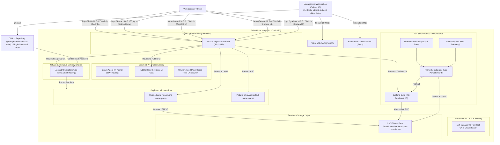

# 🚀 Production-Grade Kubernetes Homelab on Proxmox VE with Talos Linux

[](https://kubernetes.io/)
[](https://www.talos.dev/)
[](https://www.proxmox.com/)
[](https://cilium.io/)
[](https://cilium.io/)
[](https://prometheus.io/)
[](https://grafana.com/)
[](https://argo-cd.readthedocs.io/)
[](https://kubernetes.github.io/ingress-nginx/)
[](https://cert-manager.io/)
[](https://github.com/rancher/local-path-provisioner)

A secure, immutable, declarative **Kubernetes (v1.36)** infrastructure built from bare-metal virtualization on **Proxmox VE** using **Talos Linux (v1.13.8)**, powered by **Cilium eBPF Networking**, observed via **Prometheus & Grafana**, and managed via **GitOps (ArgoCD)**.

---

## 🏛️ System Architecture



---

## 📐 Architecture Decision Records (ADRs)

### 1. Why Talos Linux instead of Traditional Linux (Ubuntu/Debian)?
* **Zero Attack Surface:** No SSH daemon, no Bash/shell, and no package manager (`apt`/`yum`) on the node.
* **API-Driven Management:** 100% managed declaratively over encrypted gRPC (`port 50000`) using `talosctl`.
* **Immutable OS:** The root filesystem is a read-only SquashFS. Operating system upgrades are atomic A/B image swaps with instant rollback capability.

### 2. Why CNCF Local Path Provisioner for Storage?
* Talos Linux enforces root immutability, meaning directories like `/opt` are read-only.
* We provisioned the **CNCF Local Path Provisioner** configured specifically for Talos's persistent partition at `/var/local-path-provisioner`.
* Enables dynamic `PersistentVolume` (PV) and `PersistentVolumeClaim` (PVC) creation for stateful databases (e.g. SQLite, PostgreSQL, Prometheus TSDB).

### 3. Why NGINX Ingress with HostNetwork?
* Eliminates awkward 5-digit NodePort numbers (`:30080`, `:30001`).
* Routes incoming HTTP/HTTPS traffic at Layer 7 based on hostname matching (`Host: kuma.homelab.local`, `Host: kuma.10.0.0.170.nip.io`).

### 4. Why Automated PKI with `cert-manager`?
* Replaces error-prone manual SSL/TLS certificate creation and renewal with Kubernetes Custom Resource Definitions (CRDs).
* Deploys a **2-Tier PKI**: A 10-year self-signed Root Certificate Authority generates an intermediate `ClusterIssuer` that signs and auto-renews 90-day application certificates on the fly.

### 5. Why GitOps with ArgoCD?
* **Git as Single Source of Truth:** Cluster desired state is version-controlled on GitHub. Manual `kubectl apply` commands on production are eliminated.
* **Automated Reconciliation & Self-Healing:** ArgoCD continuously detects configuration drift and automatically restores modified or deleted cluster resources back to Git state.

### 6. Why eBPF Networking with Cilium & Hubble?
* **Bypasses iptables Bottlenecks:** Uses in-kernel eBPF bytecode for hardware-speed socket routing directly inside the Talos Linux kernel.
* **Deep Network Observability (Hubble UI):** Real-time visual mapping of all network packets, HTTP methods, latency graphs, and DNS queries without sidecar injection.
* **Layer 7 Zero-Trust Security:** Enforces `CiliumNetworkPolicy` to restrict traffic between microservices at application layer granularity.

### 7. Why Full-Stack Observability with Prometheus & Grafana?
* **Real-time Telemetry & Capacity Planning:** Scrapes sub-second metrics from the Talos host kernel (CPU, RAM, Disk I/O), Kubernetes objects, and Cilium eBPF datapaths.
* **Historical Persistence:** Allocates dedicated PersistentVolumes for Prometheus Time-Series Database (TSDB) and Grafana dashboard configurations.

---

## 📂 Repository Structure

```text
├── .gitignore                      # Prevents committing credentials/private keys
├── README.md                       # Infrastructure documentation & portfolio showcase
├── cluster-config/                 # Talos Machine Configurations
│   ├── controlplane.example.yaml   # Template config for Control Plane nodes
│   └── worker.example.yaml         # Template config for scaling Worker nodes
├── infrastructure/                 # Core Cluster Infrastructure
│   ├── certificates/
│   │   ├── cert-manager.yaml       # cert-manager deployment & CRDs (v1.17)
│   │   └── cluster-issuer.yaml     # 2-Tier PKI Root CA & ClusterIssuer
│   ├── gitops/
│   │   ├── argocd.yaml             # ArgoCD Controller engine deployment
│   │   ├── argocd-ingress.yaml     # ArgoCD Web UI Ingress with TLS
│   │   └── homelab-apps.yaml       # Root GitOps Application CRD
│   ├── monitoring/
│   │   ├── prometheus-values.yaml  # kube-prometheus-stack Helm values (Talos optimized)
│   │   └── grafana-ingress.yaml    # Grafana Dashboard HTTPS Ingress
│   ├── networking/
│   │   ├── cilium-values.yaml      # Cilium eBPF & Hubble Helm values
│   │   ├── hubble-ingress.yaml     # Hubble UI Ingress with TLS
│   │   └── security-policy.yaml    # CiliumNetworkPolicy L7 Zero-Trust rules
│   ├── storage/
│   │   └── local-path-storage.yaml # Local Path Provisioner (StorageClass: local-path)
│   └── ingress/
│       ├── ingress-nginx.yaml      # NGINX Ingress Controller deployment
│       └── ingress-routes.yaml     # Layer 7 Ingress routing rules with TLS
└── apps/                           # Deployed Application Workloads (Managed via GitOps)
    ├── monitoring/
    │   └── uptime-kuma.yaml        # Uptime Kuma monitoring (StatefulSet/PVC)
    └── demo/
        └── hello-talos.yaml        # Stateless Podinfo test deployment
```

---

## 🛠️ Step-by-Step Provisioning Guide

### 1. Proxmox VM Hardware Specs
* **CPU:** 2+ vCPUs (Type: `host`)
* **RAM:** 4096 MB
* **Disk:** VirtIO SCSI, Discard: Enabled, SSD Emulation: Enabled (20–40+ GB)
* **OS:** Talos Linux ISO customized with `siderolabs/qemu-guest-agent` via [Talos Image Factory](https://factory.talos.dev).

### 2. Generating Machine Configs & Bootstrapping
```bash
# 1. Generate declarative configurations
talosctl gen config "proxmox-k8s" https://<NODE_IP>:6443 --install-disk /dev/sda

# 2. Apply config to node in maintenance mode
talosctl apply-config --insecure --nodes <NODE_IP> --file controlplane.yaml

# 3. Bootstrap etcd and initialize Kubernetes
talosctl --talosconfig ./talosconfig bootstrap

# 4. Fetch admin kubeconfig
talosctl --talosconfig ./talosconfig kubeconfig .
```

### 3. Deploying Core Infrastructure, Networking, Metrics & GitOps
```bash
# Deploy persistent storage
kubectl apply -f infrastructure/storage/local-path-storage.yaml

# Deploy cert-manager & PKI ClusterIssuers
kubectl apply -f infrastructure/certificates/cert-manager.yaml
kubectl apply -f infrastructure/certificates/cluster-issuer.yaml

# Deploy NGINX Ingress Controller & TLS Routing
kubectl apply -f infrastructure/ingress/ingress-nginx.yaml
kubectl apply -f infrastructure/ingress/ingress-routes.yaml

# Deploy Cilium eBPF & Hubble UI
helm upgrade --install cilium cilium/cilium --namespace kube-system -f infrastructure/networking/cilium-values.yaml
kubectl apply -f infrastructure/networking/hubble-ingress.yaml

# Deploy Prometheus & Grafana Observability Stack
helm upgrade --install prometheus prometheus-community/kube-prometheus-stack --namespace monitoring -f infrastructure/monitoring/prometheus-values.yaml
kubectl apply -f infrastructure/monitoring/grafana-ingress.yaml

# Deploy ArgoCD GitOps Engine
kubectl create namespace argocd
kubectl apply --server-side --force-conflicts -n argocd -f infrastructure/gitops/argocd.yaml
kubectl apply -f infrastructure/gitops/argocd-ingress.yaml
kubectl apply -f infrastructure/gitops/homelab-apps.yaml
```

---

## 🔒 Security & Secrets Management Best Practice

> **Golden Rule of DevOps:** Live cluster secrets, tokens, and private keys (`talosconfig`, `kubeconfig`, raw `controlplane.yaml`) are strictly excluded from Git via `.gitignore`.
> 
> In enterprise environments, secrets are managed through **Sealed Secrets**, **External Secrets Operator** with HashiCorp Vault, or **SOPS** encryption before committing.

---

## 📊 Day-2 Operations Cheatsheet

| Task | Command |
| :--- | :--- |
| **Inspect Monitoring Stack** | `kubectl get pods,pvc,ingress -n monitoring` |
| **Cilium Cluster Status** | `cilium status` |
| **Hubble Real-time CLI Traffic Stream** | `cilium hubble port-forward & hubble observe` |
| **ArgoCD Applications Status** | `kubectl get applications -n argocd` |
| **Talos Live Terminal Dashboard** | `talosctl --talosconfig talosconfig dashboard` |
| **Inspect Kubernetes Pods** | `kubectl get pods -A -o wide` |
| **Inspect Persistent Storage** | `kubectl get pv,pvc -A` |
| **Inspect TLS Certificates** | `kubectl get certificates,clusterissuers -A` |
| **Inspect Ingress Routes** | `kubectl get ingress -A` |

---

## 👤 Author & Homelab Engineer
Built by **Pedro Griff** as an Infrastructure-as-Code (IaC) and Cloud Platform portfolio project.
