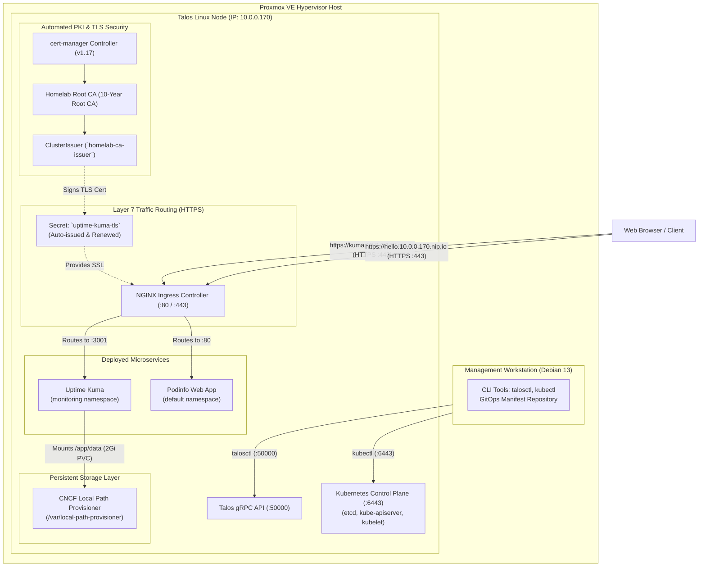

# 🚀 Production-Grade Kubernetes Homelab on Proxmox VE with Talos Linux

[](https://kubernetes.io/)
[](https://www.talos.dev/)
[](https://www.proxmox.com/)
[](https://kubernetes.github.io/ingress-nginx/)
[](https://cert-manager.io/)
[](https://github.com/rancher/local-path-provisioner)

A secure, immutable, declarative **Kubernetes (v1.36)** infrastructure built from bare-metal virtualization on **Proxmox VE** using **Talos Linux (v1.13.8)**.

---

## 🏛️ System Architecture



---

## 📐 Architecture Decision Records (ADRs)

### 1. Why Talos Linux instead of Traditional Linux (Ubuntu/Debian)?
* **Zero Attack Surface:** No SSH daemon, no Bash/shell, and no package manager (`apt`/`yum`) on the node.
* **API-Driven Management:** 100% managed declaratively over encrypted gRPC (`port 50000`) using `talosctl`.
* **Immutable OS:** The root filesystem is a read-only SquashFS. Operating system upgrades are atomic A/B image swaps with instant rollback capability.

### 2. Why CNCF Local Path Provisioner for Storage?
* Talos Linux enforces root immutability, meaning directories like `/opt` are read-only.
* We provisioned the **CNCF Local Path Provisioner** configured specifically for Talos's persistent partition at `/var/local-path-provisioner`.
* Enables dynamic `PersistentVolume` (PV) and `PersistentVolumeClaim` (PVC) creation for stateful databases (e.g. SQLite, PostgreSQL).

### 3. Why NGINX Ingress with HostNetwork?
* Eliminates awkward 5-digit NodePort numbers (`:30080`, `:30001`).
* Routes incoming HTTP/HTTPS traffic at Layer 7 based on hostname matching (`Host: kuma.homelab.local`, `Host: kuma.10.0.0.170.nip.io`).

### 4. Why Automated PKI with `cert-manager`?
* Replaces error-prone manual SSL/TLS certificate creation and renewal with Kubernetes Custom Resource Definitions (CRDs).
* Deploys a **2-Tier PKI**: A 10-year self-signed Root Certificate Authority generates an intermediate `ClusterIssuer` that signs and auto-renews 90-day application certificates on the fly.

---

## 📂 Repository Structure

```text
├── .gitignore                      # Prevents committing credentials/private keys
├── README.md                       # Infrastructure documentation & portfolio showcase
├── cluster-config/                 # Talos Machine Configurations
│   ├── controlplane.example.yaml   # Template config for Control Plane nodes
│   └── worker.example.yaml         # Template config for scaling Worker nodes
├── infrastructure/                 # Core Cluster Infrastructure
│   ├── certificates/
│   │   ├── cert-manager.yaml       # cert-manager deployment & CRDs (v1.17)
│   │   └── cluster-issuer.yaml     # 2-Tier PKI Root CA & ClusterIssuer
│   ├── storage/
│   │   └── local-path-storage.yaml # Local Path Provisioner (StorageClass: local-path)
│   └── ingress/
│       ├── ingress-nginx.yaml      # NGINX Ingress Controller deployment
│       └── ingress-routes.yaml     # Layer 7 Ingress routing rules with TLS
└── apps/                           # Deployed Application Workloads
    ├── monitoring/
    │   └── uptime-kuma.yaml        # Uptime Kuma monitoring (StatefulSet/PVC)
    └── demo/
        └── hello-talos.yaml        # Stateless Podinfo test deployment
```

---

## 🛠️ Step-by-Step Provisioning Guide

### 1. Proxmox VM Hardware Specs
* **CPU:** 2+ vCPUs (Type: `host`)
* **RAM:** 4096 MB
* **Disk:** VirtIO SCSI, Discard: Enabled, SSD Emulation: Enabled (20–40+ GB)
* **OS:** Talos Linux ISO customized with `siderolabs/qemu-guest-agent` via [Talos Image Factory](https://factory.talos.dev).

### 2. Generating Machine Configs & Bootstrapping
```bash
# 1. Generate declarative configurations
talosctl gen config "proxmox-k8s" https://<NODE_IP>:6443 --install-disk /dev/sda

# 2. Apply config to node in maintenance mode
talosctl apply-config --insecure --nodes <NODE_IP> --file controlplane.yaml

# 3. Bootstrap etcd and initialize Kubernetes
talosctl --talosconfig ./talosconfig bootstrap

# 4. Fetch admin kubeconfig
talosctl --talosconfig ./talosconfig kubeconfig .
```

### 3. Deploying Core Infrastructure, PKI & Workloads
```bash
# Deploy persistent storage
kubectl apply -f infrastructure/storage/local-path-storage.yaml

# Deploy cert-manager & PKI ClusterIssuers
kubectl apply -f infrastructure/certificates/cert-manager.yaml
kubectl apply -f infrastructure/certificates/cluster-issuer.yaml

# Deploy NGINX Ingress Controller & TLS Routing
kubectl apply -f infrastructure/ingress/ingress-nginx.yaml
kubectl apply -f infrastructure/ingress/ingress-routes.yaml

# Deploy Applications
kubectl apply -f apps/demo/hello-talos.yaml
kubectl apply -f apps/monitoring/uptime-kuma.yaml
```

---

## 🔒 Security & Secrets Management Best Practice

> **Golden Rule of DevOps:** Live cluster secrets, tokens, and private keys (`talosconfig`, `kubeconfig`, raw `controlplane.yaml`) are strictly excluded from Git via `.gitignore`.
> 
> In enterprise environments, secrets are managed through **Sealed Secrets**, **External Secrets Operator** with HashiCorp Vault, or **SOPS** encryption before committing.

---

## 📊 Day-2 Operations Cheatsheet

| Task | Command |
| :--- | :--- |
| **Talos Live Terminal Dashboard** | `talosctl --talosconfig talosconfig dashboard` |
| **Node Kernel Logs (dmesg)** | `talosctl --talosconfig talosconfig dmesg` |
| **Talos System Services** | `talosctl --talosconfig talosconfig service` |
| **Inspect Kubernetes Pods** | `kubectl get pods -A -o wide` |
| **Inspect Persistent Storage** | `kubectl get pv,pvc -A` |
| **Inspect TLS Certificates** | `kubectl get certificates,clusterissuers -A` |
| **Inspect Ingress Routes** | `kubectl get ingress -A` |

---

## 👤 Author & Homelab Engineer
Built by **Pedro Griff** as an Infrastructure-as-Code (IaC) and Cloud Platform portfolio project.
